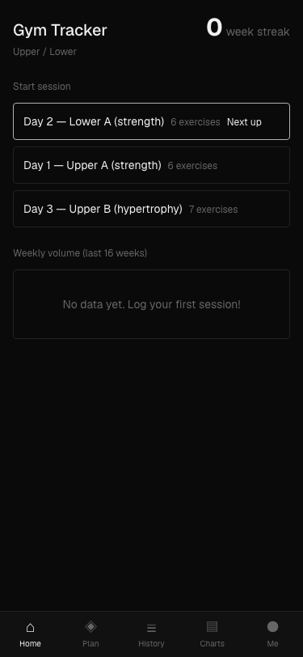
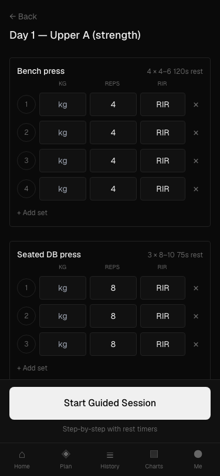
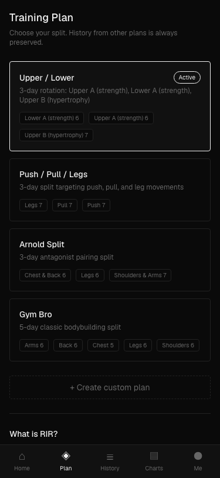
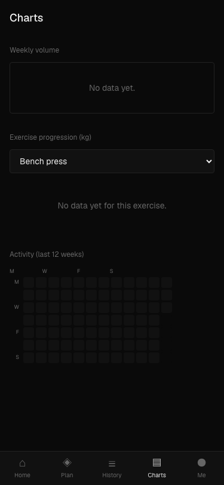

# gymtracker_

Personal gym tracker with progressive overload detection. Mobile-first, dark or light.

[](https://vercel.com/new/clone?repository-url=https://github.com/rhozacc/gymtracker_&env=APP_PIN&envDescription=4-digit+PIN+to+protect+your+app&project-name=gymtracker)

**Demo PIN: `0000`** — try it on the live deployment. Deploy your own copy for a private instance with your own PIN.

<p align="center">
  
  
  
  
</p>

## Features

**Onboarding wizard** — first-launch flow picks theme, weight unit, training style (men's/women's), goal (bulk/balanced/lean), a recommended plan, and optional session extras.

**Training plans** — built-in splits for men's and women's training, plus a custom plan builder. Switch plans anytime; history is always preserved. Drag-and-drop to reorder days within a plan.

**Session logging** — per-set tracking of weight, reps, and RIR (Reps in Reserve). Add or remove sets on the fly. Unit toggle between kg and lbs (all data stored in kg).

**Guided mode** — step-by-step session walkthrough with automatic rest timers, screen wake lock, and background notifications when the timer ends.

**Smart overload feedback** — uses rep range and RIR data to give three-tier advice:
- *Go up* (green) — hit reps comfortably at RIR 2+, time to add weight
- *Almost ready* (amber) — hit reps but grinding (RIR 0–1), repeat the weight to consolidate
- Falls back to rep-range-only logic when no RIR is recorded

**Session extras** — optional post-workout add-ons (abs, cardio, stretch) chosen during onboarding and prompted after each session.

**Post-session debrief** — rate energy, pump, and mood (1–5) after each session.

**Charts & history** — weekly volume by day type, exercise e1RM progression, muscle group breakdown, 12-week activity heatmap, full session history with detail views.

**Light / dark mode** — toggle from the dashboard; persisted to the database.

**PIN + biometric login** — 4-digit PIN gate with optional WebAuthn (Face ID / fingerprint / passkey) as a second login method. No auth library, no accounts.

**PWA** — installable as a home screen app with a service worker for offline shell caching.

## Stack

Next.js 14 (App Router) · TypeScript · Tailwind CSS · Prisma · Neon Postgres · Recharts · SWR · SimpleWebAuthn

## Deploy to Vercel

1. Click the deploy button above
2. Set `APP_PIN` to a 4-digit PIN when prompted
3. Add a Neon Postgres database from the [Vercel Marketplace](https://vercel.com/marketplace/neon) and link it to your project — this auto-sets `POSTGRES_URL` and `POSTGRES_URL_NON_POOLING`
4. Push the database schema:
   ```bash
   npx vercel env pull .env.local
   npx prisma db push
   ```

## Local development

```bash
git clone https://github.com/rhozacc/gymtracker_.git && cd gymtracker_
cp .env.example .env.local
# Fill in your Postgres connection strings and PIN
npm install
npm run db:push
npm run dev
```

Open [http://localhost:3000](http://localhost:3000).

## Environment variables

| Variable | Description |
|----------|-------------|
| `POSTGRES_URL` | Neon pooled connection string (auto-set by Vercel Marketplace) |
| `POSTGRES_URL_NON_POOLING` | Neon direct connection string (auto-set by Vercel Marketplace) |
| `APP_PIN` | 4-digit PIN to access the app |
| `RP_ID` | Optional — WebAuthn relying party ID for biometric login (defaults to request hostname) |

When deploying via the button, the Postgres variables are provisioned automatically. You only need to set `APP_PIN`. `RP_ID` is only needed if biometric login breaks due to a hostname mismatch (uncommon on Vercel).
