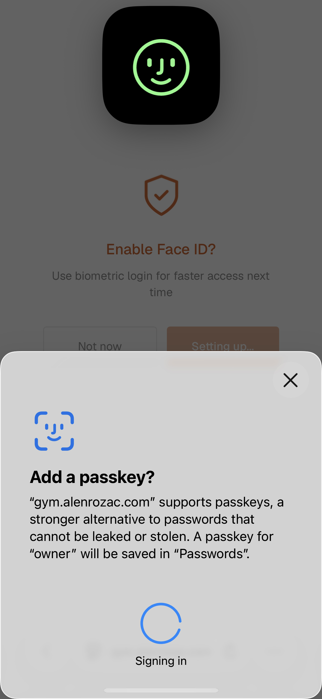
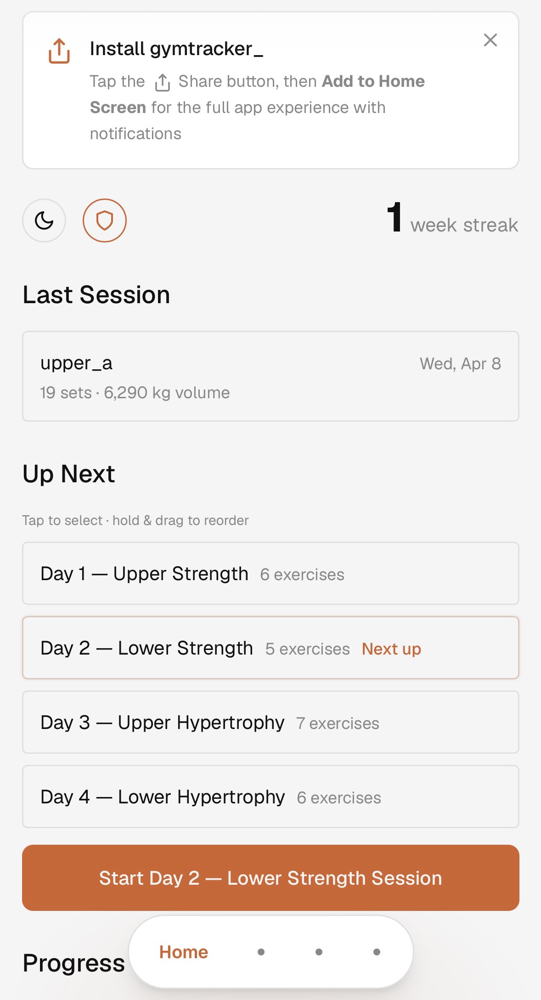
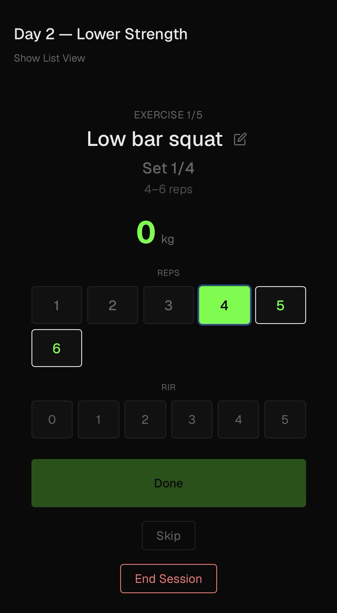
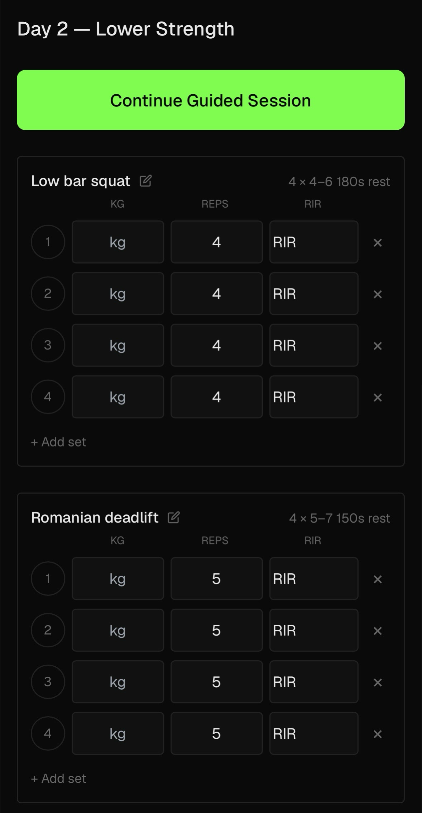

# gymtracker_

Personal gym tracker with progressive overload detection. Mobile-first PWA, dark or light.

[](https://vercel.com/new/clone?repository-url=https://github.com/rhozacc/gymtracker_&env=APP_PIN&envDescription=4-digit+PIN+to+protect+your+app&project-name=gymtracker&integration-ids=oac_3sK3gnG06emjIEVL09jjntDD&skippable-integrations=1)

One click deploys the app, provisions a Neon Postgres database, and applies the schema automatically. Just set a 4-digit PIN when prompted.

**Demo PIN: `0000`** -- try it on the live deployment. Deploy your own copy for a private instance with your own PIN.

<p align="center">
  
  
  
  
  
</p>

## Features

- **Onboarding wizard** -- theme, unit, training style, goal, plan recommendation, and session extras
- **Training plans** -- built-in splits for men's and women's training, custom plan builder, drag-and-drop reorder
- **Session logging** -- per-set weight, reps, and RIR tracking with on-the-fly set management
- **Guided mode** -- step-by-step walkthrough with rest timers, wake lock, and background notifications
- **Overload feedback** -- three-tier advice (go up / almost ready / hold) based on rep range and RIR
- **Session extras** -- optional post-workout add-ons (abs, cardio, stretch)
- **Post-session debrief** -- rate energy, pump, and mood
- **Charts** -- weekly volume, e1RM progression, muscle breakdown, 12-week activity heatmap, full history
- **Light / dark mode** -- toggle from dashboard, persisted to DB
- **PIN + biometric login** -- 4-digit PIN with optional WebAuthn (Face ID / fingerprint / passkey)
- **PWA** -- installable home screen app with offline shell caching

## Stack

Next.js 14 (App Router) / TypeScript / Tailwind CSS / Prisma / Neon Postgres / Recharts / SWR / SimpleWebAuthn

## One-click deploy

Click the button above. The deploy flow will:

1. Clone the repo to your GitHub
2. Provision a Neon Postgres database (auto-sets `POSTGRES_URL` and `POSTGRES_URL_NON_POOLING`)
3. Prompt you for a 4-digit `APP_PIN`
4. Build and deploy -- the build step applies the database schema automatically

No manual setup required.

## Local development

```bash
git clone https://github.com/rhozacc/gymtracker_.git && cd gymtracker_
cp .env.example .env.local
# Fill in Postgres connection strings and PIN
npm install
npm run db:push
npm run dev
```

## Environment variables

| Variable | Description |
|---|---|
| `POSTGRES_URL` | Neon pooled connection string (auto-set by Vercel) |
| `POSTGRES_URL_NON_POOLING` | Neon direct connection string (auto-set by Vercel) |
| `APP_PIN` | 4-digit PIN to access the app |
| `RP_ID` | Optional -- WebAuthn relying party ID (defaults to request hostname) |
